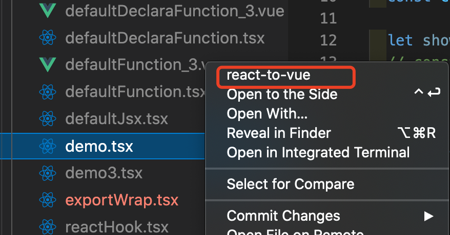

# plugin-react-to-vue README

extension "plugin-react-to-vue"

## How to use

right-click the file with the file suffix `.tsx` or `.jsx` and  select `react-to-vue` in the menu option. The following example:

**Enjoy!**
